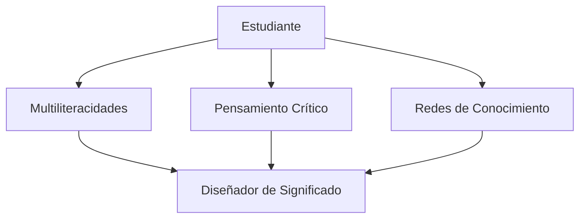
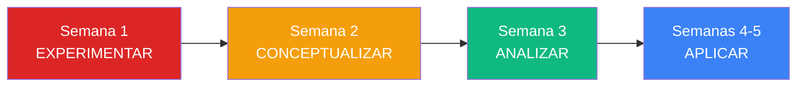

# Análisis y Propuesta de Adecuación Curricular

Del Aprendizaje Fragmentado al Diseño Integrado de Significado

  
    Hesus Garcia Cobos
  

  UPAEP · Análisis del Currículum · 2025

---
layout: two-cols
---

# Marcos Teóricos

<v-clicks>

## 🎨 Multiliteracidades
**Cope & Kalantzis (2009)**
- Estudiantes como diseñadores activos
- Múltiples modos de comunicación

## 🔍 Enfoque Socio-Crítico
**Apple (1979)**
- El currículum no es neutral
- ¿A quién sirve?

## 🌐 Conectivismo
**Siemens (2005)**
- Aprendizaje en redes
- Saber dónde encontrar

</v-clicks>

::right::

---

# El Problema: Estado Actual (SER)

### 📚 Currículum Tradicional

<v-clicks>

- Módulos independientes
- Transmisión de conceptos
- Casos controlados y ficticios
- Exámenes conceptuales
- Tecnología como fin
- Estudiante receptor pasivo

</v-clicks>

### ⚠️ Consecuencias

<v-clicks>

- Conocimiento fragmentado
- Desconexión teoría-práctica
- Sin reflexión crítica
- Reproducción vs creación

</v-clicks>

---

# La Propuesta: Estado Deseado (DEBER SER)

### 🎯 Currículum Transformado

<v-clicks>

- Secuencia integrada
- Conocimiento multimodal
- Problemas auténticos
- Portafolios multimodales
- Tecnología como medio
- Estudiante diseñador

</v-clicks>

### ✨ Impacto Esperado

<v-clicks>

- Mayor engagement
- Pensamiento crítico
- Conocimiento transferible
- Reflexión ética

</v-clicks>

---
layout: center
---

# Comparación: SER vs DEBER SER

| Aspecto | SER (Actual) | DEBER SER (Propuesta) |
|---------|-------------|----------------------|
| Estructura | Módulos independientes | Secuencia integrada |
| Epistemología | Transmisión | Construcción multimodal |
| Casos | Ficticios controlados | Problemas auténticos |
| Rol estudiante | Receptor pasivo | Diseñador activo |
| Reflexión | Ausente | "¿A quién sirve?" |
| Evaluación | Exámenes | Portafolios |

---

# Secuencia Didáctica Propuesta

🔍

Inmersión en reto auténtico

💡

Mapas visuales, discusión crítica

📊

FODA contextualizado

🎨

Portafolio multimodal

---

# Integración de Teorías en Actividades

| Actividad | Multiliteracidades | Socio-Crítico | Conectivismo |
|-----------|-------------------|---------------|--------------|
| Diagnóstico | Infografías | "¿Qué invisibilizamos?" | Múltiples fuentes |
| Mapeo | Mapas interactivos | "¿A quién beneficia?" | Plataformas digitales |
| FODA | Video, visual, escrito | "¿Voces ausentes?" | Retroalimentación pares |
| Reporte | Portafolio digital | Reflexión poder/ideología | Comunidad de práctica |

---
layout: center
class: text-center
---

# Reflexión Final

<v-clicks>

### El currículum es hipótesis a probar en la práctica
**Stenhouse (1975)**

### Los estudiantes merecen ser tratados como diseñadores de significado
**No como receptáculos vacíos**

### La reflexión crítica constante es esencial
**Para no reproducir desigualdades**

</v-clicks>

---
layout: center
class: text-center
---

# ¿Preguntas?

  
    Hesus Garcia Cobos
  

  Universidad Popular Autónoma del Estado de Puebla 
  Análisis del Currículum · Noviembre 2025

---
layout: end
---

# Gracias

Del aprendizaje fragmentado al diseño integrado de significado
