# Del Aprendizaje Fragmentado al Diseño Integrado de Significado

Análisis y Adecuación Curricular · MT1001B

  
    Hesus Garcia Cobos
  

  UPAEP · Análisis del Currículum · Noviembre 2025

---
layout: image-right
image: https://images.unsplash.com/photo-1523050854058-8df90110c9f1?w=800
backgroundSize: cover
---

# Contexto del Proyecto

  
Curso Analizado

  
MT1001B: Descubrimientos del mercado

  
Tecnológico de Monterrey · Modelo Tec21

  
Duración

  
60 horas · 5 semanas

  
Semestre 2 · Entrada de Negocios

  
Propósito del Proyecto

  
Transformar un currículum fragmentado hacia uno integrado y auténtico

---

# Alcance de la Propuesta

```mermaid {scale: 0.55}
graph TD
    subgraph MACRO["🏛️ MACRO - Institucional"]
        A[Plan de Estudios<br/>Tec21]
    end
    subgraph MESO["📋 MESO - Programático"]
        B[Bloque MT1001B<br/>60 horas]
    end
    subgraph MICRO["🎯 MICRO - Áulico"]
        C[Módulo 1<br/>20 hrs]
        D[Módulo 2<br/>20 hrs]
        E[Reto<br/>20 hrs]
    end
    A --> B
    B --> C
    B --> D
    B --> E
    style C fill:#DC2626,color:#fff,stroke:#991b1b,stroke-width:3px
    style MICRO fill:#fef2f2,stroke:#DC2626
```

  
Nivel MICRO (áulico)

  
No modifico objetivos institucionales (macro) ni diseño del bloque (meso). Propongo adecuaciones que el docente puede implementar.

  
"El contenido cultural que las instituciones tratan de difundir"

  
— Gimeno Sacristán

  
"Curriculum: el diseño del programa de aprendizaje a lo largo del tiempo"

  
La visión que me hace más sentido es la de <b>Cope & Kalantzis</b>: un currículum <b>reflexivo</b>, abierto, contextual y transformador. Diseñar para pensar y cuestionar, no solo cubrir contenidos.

---

# ¿Cómo Entiendo el Currículum?

"El contenido cultural que las instituciones educativas tratan de difundir"

— Gimeno Sacristán

<v-clicks>

  
🎨

  
Multiliteracidades

  
Cope & Kalantzis

  
El estudiante como <b>diseñador activo</b> de significado multimodal

  
🔍

  
Enfoque Socio-Crítico

  
Michael Apple

  
El currículum no es neutral: <b>¿a quién sirve?</b>

  
🌐

  
Conectivismo

  
George Siemens

  
Saber <b>dónde encontrar</b> es tan importante como saber qué

</v-clicks>

---
layout: image-left
image: https://images.unsplash.com/photo-1494059980473-813e73ee784b?w=800
backgroundSize: cover
class: pl-8
---

# El Problema: SER

Estado actual del currículum

<v-clicks>

  📦
  Conocimiento fragmentado

  👤
  Estudiante = receptor pasivo

  📝
  Casos ficticios

  📊
  Evaluación = memorización

  💻
  Tecnología como fin, no medio

</v-clicks>

---

# Validación con Inteligencia Artificial

Metodología: Wideband Delphi con 5 agentes IA especializados

  

<v-clicks>

  
Fortaleza Principal

  
Conexión teoría-práctica: 8.0

  
Modelo Tec21 con retos aplicados

  
Área de Oportunidad

  
Reflexión crítica: 6.0

  
Análisis sin cuestionamiento profundo

  
Debilidades

  
Evaluación: 5.75 · Tecnología: 5.5

  
Examen 70%, tech como entrega

</v-clicks>

  Metodología: Wideband Delphi en 3 rondas con agentes IA (Crítico, Multiliteracidades, Conectivista, Marketing Educativo, Pedagogía Crítica) usando Llama 3.3, Qwen 72B y GPT-4o. Limitación: Valor exploratorio y didáctico; no sustituye evaluación con expertos humanos.

  
  
Metodología completa

---
layout: center
class: text-center
---

# Problema Central Identificado

  
💻

  
Falta de Integración Tecnológica

  
Puntuación: 5.5/10

  
La tecnología se usa para entregar tareas, no para aprender

  
📝

  
Evaluación = Memorización

  
Puntuación: 5.75/10

  
Examen del 70% sobre capítulos del libro de texto

<v-clicks>

  📚
  Memorización del libro de texto

  🎭
  Casos ficticios inventados

</v-clicks>

---

# Visión: DEBER SER

```mermaid {scale: 0.85}
graph LR
    A["SER<br/>Fragmentado<br/>Pasivo<br/>Ficticio"] -->|Transformación| B["DEBER SER<br/>Integrado<br/>Activo<br/>Auténtico"]
    style A fill:#991b1b,color:#fff
    style B fill:#166534,color:#fff
```

Propuesta de transformación a nivel MICRO (áulico)

<v-clicks>

  
Antes

  

    
Casos ficticios inventados

    
Examen 70% (memorización del libro)

    
Trabajo individual aislado

  

  
Después

  

    
Datos reales (Kaggle, INEGI)

    
Evaluación multimodal (40-30-30)

    
Foros + IA + Colaboración

  

</v-clicks>

  
  
Sesiones modificadas

---

# Cambio en Objetos de Aprendizaje

  OA (Objeto de Aprendizaje) = evaluación formativa y sumativa en el modelo Tec21

<v-clicks>

  
OA1: Diagnóstico

  

    

      +
      Mapa conceptual digital
    

    

      +
      Datos reales (Kaggle / INEGI)
    

    

      +
      Presentación con IA
    

    

      +
      Reflexión crítica
    

  

  
OA2: Evaluación

  

    

      
40%

      
Examen

    

    

      
30%

      
Datos

    

    

      
30%

      
IA+Foro

    

  

</v-clicks>

Evaluación diversificada: examen + datos + colaboración

  
  
Rediseño OA1 y OA2

---

# Secuencia Didáctica

  Basada en el <b>currículum reflexivo</b> de Cope & Kalantzis: macro-secuencia abierta, no lineal, que conecta con el contexto del estudiante

<v-clicks>

  
🤖

  
Diálogo con IA

  
Preguntas socráticas, exploración guiada

  
💡

  
Mapas + Foros

  
Visualización, discusión en Canvas

  
📊

  
Datos reales

  
Kaggle, INEGI, análisis auténtico

  
🎨

  
Portafolio

  
Productos multimodales

</v-clicks>

  Se negocian problemas, proyectos y productos · Reflexión sobre qué y cómo se aprende

---

# Elementos Innovadores

<v-clicks>

  
🎮

  
Gamificación

  

    
Badges digitales

    
Tabla de equipos

    
Módulos desbloqueables

    
Narrativa de consultoría

  

  
📊

  
Analytics

  

    
Google Trends

    
Análisis de hashtags

    
A/B testing conceptual

    
Redes sociales

  

  
🤖

  
IA Reflexiva

  

    
GPT como cuestionador

    
No fuente de respuestas

    
Diálogo socrático

    
Exportar y reflexionar

  

</v-clicks>

  <b>Fundamento:</b> Multiliteracidades (diseño multimodal) + Conectivismo (aprendizaje en red) + Currículum crítico (cuestionamiento del poder)

---
layout: center
class: text-center
---

# Gamificación en Acción

Ejemplo de sistema de badges y logros en educación

  

  Badges, tablas de posiciones y módulos desbloqueables aumentan la motivación intrínseca

---
layout: center
class: text-center
---

# ¿Qué es Kaggle?

Comunidad de aprendizaje y datos abiertos

  

  Miles de datasets reales de marketing, consumo y comportamiento del cliente

---
layout: center
class: text-center
---

# Diálogos Guiados con IA

GPT programado para preguntas socráticas

  

  El estudiante exporta el diálogo y reflexiona: ¿Qué aprendí de esta conversación?

---

# Justificación Teórica

  

    🎨
  

  
Multiliteracidades

  
Cope & Kalantzis

  

    Estudiante como <b>diseñador de significado</b>: mapas, slides con IA, productos visuales
  

  

    🔍
  

  
Currículum Crítico

  
Apple

  

    Preguntas de <b>poder</b>: ¿A quién beneficia? ¿Quién queda fuera? ¿Qué sesgos?
  

  

    🌐
  

  
Conectivismo

  
Siemens

  

    Aprendizaje en <b>redes</b>: Kaggle, Stack Exchange, Canvas, IA como nodo
  

---
layout: image-right
image: https://images.unsplash.com/photo-1499750310107-5fef28a66643?w=800
backgroundSize: cover
---

# Lo que Aprendí

"Diseñar un buen currículum es mucho más difícil de lo que pensaba"

<v-clicks>

  🏛️
  Políticas institucionales

  👥
  Diversidad de estudiantes

  💰
  Recursos limitados

  👁️
  Ideologías implícitas

  🔇
  Voces que quedan fuera

</v-clicks>

---

# Autores que Seguiré Leyendo

<v-clicks>

  

    
  

  
Mary Kalantzis

  
U. Illinois

  
Multiliteracidades

  

    "Diseñador de significado"
  

  

    
  

  
Bill Cope

  
U. Illinois

  
Multiliteracidades

  

    "Aprendizaje multimodal"
  

  

    
  

  
Michael Apple

  
U. Wisconsin

  
Currículum Crítico

  

    "¿A quién sirve?"
  

  

    
  

  
George Siemens

  
U. Texas Arlington

  
Conectivismo

  

    "Saber dónde encontrar"
  

</v-clicks>

---
layout: center
class: text-center
---

# "El currículum nunca es simplemente un montaje neutral de conocimientos... Es siempre parte de una tradición selectiva"

— Michael Apple

  

  github.com/HesusG/analsisis-del-curriculo-upaep

  
    ¿Preguntas?
  

  Hesus Garcia Cobos · UPAEP · 2025

